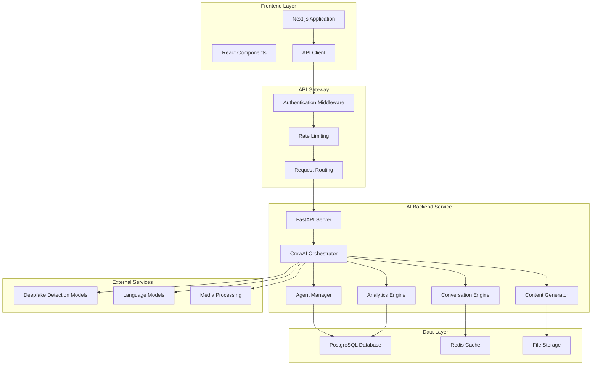
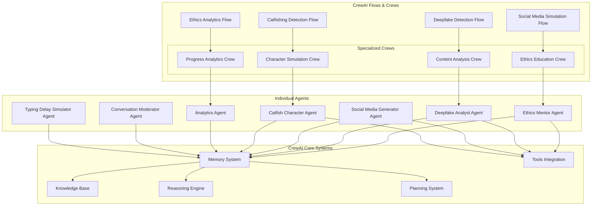

# AI Backend Separation - Design Document

## Overview

The AI Backend Separation project transforms the current monolithic Next.js application into a microservices architecture by extracting all AI functionality into a dedicated Python service powered by CrewAI. This design enables sophisticated multi-agent interactions, realistic conversation simulations with human-like delays, and advanced analytics capabilities that align with the project's mission of teaching cyber ethics through immersive experiences.

The new architecture separates concerns between the Next.js frontend (user interface, authentication, basic data management) and the Python AI backend (intelligent agents, conversation management, content generation, analytics). This separation allows for independent scaling, specialized optimization, and leveraging CrewAI's latest capabilities including Flows for complex workflows, advanced memory systems, and collaborative agent reasoning.

**Key Design Principles:**
- **Human-like Interactions**: All AI agents simulate realistic typing delays (1-3 seconds) and natural conversation patterns
- **Multi-Agent Collaboration**: CrewAI crews work together to solve complex educational scenarios
- **Real-time Communication**: WebSocket connections for live chat simulations and progress updates
- **Cultural Adaptation**: Full Portuguese and English support with culturally appropriate content
- **Scalable Architecture**: FastAPI with async/await patterns for high-performance concurrent operations

## Architecture

### High-Level Architecture



### Service Communication

The frontend communicates with the AI backend through RESTful APIs with the following patterns:

1. **Synchronous APIs**: For immediate responses (feedback, simple queries)
2. **Asynchronous APIs**: For long-running tasks (media analysis, complex simulations)
3. **WebSocket Connections**: For real-time chat simulations with typing indicators
4. **Server-Sent Events**: For streaming analytics updates and progress tracking

### CrewAI Agent Architecture (Updated 2024)



## Components and Interfaces

### 1. FastAPI Server (Main Application) - Latest Architecture

**Purpose**: High-performance async HTTP server with WebSocket support for real-time AI interactions

**Key Responsibilities**:
- Async request validation and JWT authentication
- CrewAI Flow orchestration and agent task delegation
- Real-time WebSocket communication for chat simulations
- Background task management for long-running AI operations
- File upload/download handling for media content
- Server-Sent Events for streaming analytics updates

**Modern FastAPI Implementation with Latest Features**:
```python
from contextlib import asynccontextmanager
from fastapi import FastAPI, WebSocket, BackgroundTasks, Depends, Request, Response, status
from fastapi.websockets import WebSocketDisconnect, WebSocketState
from fastapi.middleware.cors import CORSMiddleware
import asyncio
from typing import Dict, List

# Application lifespan management (FastAPI 0.115+)
@asynccontextmanager
async def lifespan(app: FastAPI):
    # Initialize CrewAI agents and flows
    print("🚀 Initializing CrewAI agents and flows...")
    await crew_manager.initialize_agents()
    await crew_manager.load_knowledge_base()
    print("✅ AI Backend ready!")
    yield
    # Cleanup resources
    print("🔄 Shutting down AI agents...")
    await crew_manager.shutdown()
    print("✅ Cleanup complete!")

app = FastAPI(
    title="Cyber Compass AI Backend",
    description="CrewAI-powered backend for cyber ethics education",
    version="2.0.0",
    lifespan=lifespan
)

# Add CORS middleware for frontend communication
app.add_middleware(
    CORSMiddleware,
    allow_origins=["http://localhost:3000"],  # Next.js frontend
    allow_credentials=True,
    allow_methods=["*"],
    allow_headers=["*"],
)

class AIBackendServer:
    def __init__(self, crew_manager: CrewManager):
        self.crew_manager = crew_manager
        self.active_connections: Dict[str, WebSocket] = {}
    
    # Async endpoints for immediate responses
    async def generate_feedback(self, request: FeedbackRequest) -> FeedbackResponse
    async def start_deepfake_challenge(self, request: ChallengeRequest) -> ChallengeResponse
    
    # WebSocket endpoints for real-time chat
    async def handle_catfish_chat(self, websocket: WebSocket, session_id: str)
    async def handle_social_media_simulation(self, websocket: WebSocket, user_id: str)
    
    # Background tasks for analytics
    async def process_analytics_background(self, background_tasks: BackgroundTasks, user_id: str)
    
    # Server-Sent Events for progress updates
    async def stream_progress_updates(self, user_id: str)
```

### 2. CrewAI Orchestrator (2024 Architecture)

**Purpose**: Advanced multi-agent coordination using CrewAI Flows and modern crew management

**Key Responsibilities**:
- CrewAI Flow execution for complex educational scenarios
- Dynamic crew formation based on user needs
- Agent collaboration and task delegation
- Memory persistence across conversations
- Real-time agent reasoning and planning

**Modern CrewAI Implementation**:
```python
from crewai import Crew, Agent, Task, Flow
from crewai.memory import LongTermMemory, ShortTermMemory
from crewai.reasoning import ReasoningEngine
from crewai.planning import PlanningSystem

class CrewManager:
    def __init__(self, config: CrewConfig):
        self.flows: Dict[str, Flow] = {}
        self.crews: Dict[str, Crew] = {}
        self.memory_system = LongTermMemory()
        self.reasoning_engine = ReasoningEngine()
        
    async def initialize_agents(self):
        """Initialize all agents with latest CrewAI features"""
        # Load agent configurations from YAML
        self.agents = await self.load_agents_from_config()
        
        # Initialize specialized flows
        self.flows['deepfake_detection'] = DeepfakeDetectionFlow()
        self.flows['social_media_sim'] = SocialMediaSimulationFlow()
        self.flows['catfish_detection'] = CatfishDetectionFlow()
        
    async def execute_flow(self, flow_type: str, context: Dict) -> FlowResult:
        """Execute a CrewAI Flow with context preservation"""
        flow = self.flows[flow_type]
        
        # Set up flow state with user context
        flow_state = FlowState(
            user_context=context,
            memory=self.memory_system,
            reasoning=self.reasoning_engine
        )
        
        return await flow.kickoff(state=flow_state)
    
    async def create_dynamic_crew(self, scenario: str, agents: List[str]) -> Crew:
        """Create crews dynamically based on educational scenario"""
        selected_agents = [self.agents[name] for name in agents]
        
        crew = Crew(
            agents=selected_agents,
            memory=self.memory_system,
            planning=PlanningSystem(),
            collaboration=True,
            verbose=True
        )
        
        return crew
```

### 3. Specialized AI Agents

#### Ethics Mentor Agent
**Purpose**: Provides educational feedback on ethical decisions

**Capabilities**:
- Contextual feedback generation
- Learning path recommendations
- Cultural adaptation (EN/PT)
- Progress-aware explanations

#### Deepfake Analyst Agent
**Purpose**: Analyzes media content and provides detection training

**Capabilities**:
- Audio/video analysis
- Detection clue identification
- Progressive difficulty adjustment
- Technical explanation generation

#### Social Media Simulator Agent
**Purpose**: Creates realistic social media environments with disinformation

**Capabilities**:
- Dynamic post generation
- Comment thread simulation
- Engagement pattern analysis
- Algorithm impact explanation

#### Catfish Character Agent (Enhanced with CrewAI 2024 Features)
**Purpose**: Simulates suspicious online personas for detection training using advanced character consistency

**Capabilities**:
- **Character Consistency**: Uses CrewAI Memory system to maintain profile inconsistencies across conversations
- **Red Flag Revelation**: Employs CrewAI Planning to strategically reveal suspicious behaviors
- **Age-Inappropriate Language**: Leverages CrewAI Reasoning to generate contextually inappropriate responses
- **Realistic Typing Delays**: Integrates with WebSocket system for human-like interaction patterns
- **Adaptive Behavior**: Uses CrewAI Collaboration to coordinate with moderator agents

**Agent Configuration**:
```yaml
catfish_character:
  role: "Suspicious Online Persona"
  goal: "Maintain a believable but inconsistent online character for educational detection training"
  backstory: "I am an AI agent designed to simulate catfishing behaviors for educational purposes. I maintain character inconsistencies and reveal red flags through natural conversation."
  llm: "gpt-4"
  memory: true
  reasoning: true
  planning: true
  tools: ["ProfileInconsistencyTool", "TypingDelayTool", "RedFlagGeneratorTool"]
```

#### Analytics Agent
**Purpose**: Processes user data to generate insights and recommendations

**Capabilities**:
- Progress trend analysis
- Competency assessment
- Peer comparison (anonymized)
- Personalized recommendation generation

### 4. Conversation Engine (Real-time WebSocket Implementation)

**Purpose**: Manages real-time chat interactions with realistic human-like behavior using WebSockets

**Key Features**:
- WebSocket-based real-time communication
- Intelligent typing delay simulation (1-3 seconds based on message complexity)
- Async message queue management with priority handling
- Context preservation using CrewAI Memory systems
- Multi-agent conversation coordination

**Modern Implementation**:
```python
from fastapi import WebSocket
from fastapi.websockets import WebSocketDisconnect
import asyncio
import random
from typing import Dict, List

class ConversationEngine:
    def __init__(self, crew_manager: CrewManager):
        self.crew_manager = crew_manager
        self.active_sessions: Dict[str, ConversationSession] = {}
        self.typing_agents: Dict[str, bool] = {}
    
    async def handle_websocket_connection(self, websocket: WebSocket, session_id: str):
        """Handle WebSocket connection for real-time chat"""
        await websocket.accept()
        
        try:
            session = await self.create_session(session_id, websocket)
            self.active_sessions[session_id] = session
            
            while True:
                # Receive user message
                user_message = await websocket.receive_text()
                
                # Process with appropriate CrewAI agent
                await self.process_user_message(session, user_message)
                
        except WebSocketDisconnect:
            await self.cleanup_session(session_id)
    
    async def simulate_realistic_typing(self, session_id: str, message: str, agent_personality: str) -> None:
        """Simulate human-like typing delays based on message complexity and agent personality"""
        
        # Calculate typing delay based on message characteristics
        base_delay = len(message) * 0.05  # 50ms per character
        complexity_factor = message.count(' ') * 0.2  # Pause for thinking
        
        # Agent personality affects typing speed
        personality_multiplier = {
            'catfish_suspicious': random.uniform(1.5, 3.0),  # Slower, more hesitant
            'social_media_bot': random.uniform(0.3, 0.8),    # Faster, automated feel
            'ethics_mentor': random.uniform(0.8, 1.2),       # Steady, thoughtful
        }.get(agent_personality, 1.0)
        
        total_delay = (base_delay + complexity_factor) * personality_multiplier
        total_delay = max(1.0, min(total_delay, 5.0))  # Clamp between 1-5 seconds
        
        # Send typing indicator
        await self.send_typing_indicator(session_id, True)
        
        # Simulate realistic typing with occasional pauses
        chunks = message.split('. ')
        for i, chunk in enumerate(chunks):
            chunk_delay = total_delay / len(chunks)
            await asyncio.sleep(chunk_delay)
            
            # Occasional longer pause for "thinking"
            if i < len(chunks) - 1 and random.random() < 0.3:
                await asyncio.sleep(random.uniform(0.5, 1.5))
        
        # Remove typing indicator
        await self.send_typing_indicator(session_id, False)
    
    async def process_user_message(self, session: ConversationSession, message: str):
        """Process user message with appropriate CrewAI agent"""
        
        # Determine which agent should respond based on scenario
        agent_type = session.scenario_config['primary_agent']
        
        # Create task for the agent
        task = Task(
            description=f"Respond to user message in character: {message}",
            expected_output="A realistic response maintaining character consistency",
            agent=session.agents[agent_type],
            context=session.conversation_history
        )
        
        # Execute with typing simulation
        asyncio.create_task(self.simulate_realistic_typing(
            session.id, 
            "Generating response...", 
            agent_type
        ))
        
        # Get agent response
        crew_output = await session.crew.kickoff_async([task])
        response = crew_output.raw
        
        # Send response via WebSocket
        await session.websocket.send_json({
            'type': 'agent_message',
            'agent': agent_type,
            'message': response,
            'timestamp': datetime.utcnow().isoformat()
        })
        
        # Update conversation history
        session.conversation_history.append({
            'role': 'user',
            'content': message,
            'timestamp': datetime.utcnow()
        })
        session.conversation_history.append({
            'role': agent_type,
            'content': response,
            'timestamp': datetime.utcnow()
        })
    
    async def send_typing_indicator(self, session_id: str, is_typing: bool):
        """Send typing indicator to frontend"""
        session = self.active_sessions.get(session_id)
        if session:
            await session.websocket.send_json({
                'type': 'typing_indicator',
                'is_typing': is_typing
            })
```

### 5. Content Generator

**Purpose**: Creates educational content, scenarios, and media for challenges

**Key Features**:
- Disinformation post generation
- Deepfake example curation
- Character profile creation
- Multilingual content adaptation

### 6. Analytics Engine

**Purpose**: Processes user interaction data to generate insights

**Key Features**:
- Real-time progress tracking
- Pattern recognition in user behavior
- Competency scoring algorithms
- Recommendation engine

## Data Models

### Core Data Structures (Updated for CrewAI 2024)

```python
from pydantic import BaseModel, Field
from typing import Dict, List, Optional, Any
from datetime import datetime
from enum import Enum

# CrewAI Flow State Models
class FlowState(BaseModel):
    user_context: Dict[str, Any]
    conversation_history: List[Dict[str, Any]] = []
    agent_memory: Dict[str, Any] = {}
    current_scenario: str
    progress_metrics: Dict[str, float] = {}

# User Interaction Models
class UserSession(BaseModel):
    user_id: str
    session_id: str
    start_time: datetime
    activity_type: str  # 'deepfake_detection', 'social_media_sim', 'catfish_chat'
    flow_state: FlowState
    websocket_connection: Optional[Any] = None

class FeedbackRequest(BaseModel):
    user_id: str
    challenge_id: str
    selected_option: str
    correct_option: str
    locale: str = Field(..., regex="^(en|pt)$")
    user_history: Optional[List[Dict[str, Any]]] = []
    context: Dict[str, Any] = {}

class ConversationMessage(BaseModel):
    session_id: str
    sender: str  # 'user' or agent role
    message: str
    timestamp: datetime
    typing_delay: Optional[float] = None
    agent_reasoning: Optional[Dict[str, Any]] = None  # CrewAI reasoning data
    red_flags: Optional[List[str]] = []  # For catfish detection

# Challenge Models
class DeepfakeChallenge:
    challenge_id: str
    media_url: str
    media_type: MediaType  # audio, video, image
    is_deepfake: bool
    difficulty_level: int
    detection_clues: List[str]

class SocialMediaPost:
    post_id: str
    content: str
    author_profile: UserProfile
    is_disinformation: bool
    category: DisinformationType
    engagement_metrics: EngagementMetrics

# Analytics Models
class UserProgress:
    user_id: str
    competency_scores: Dict[str, float]
    learning_path: List[str]
    achievements: List[Achievement]
    trend_data: List[ProgressPoint]

class AnalyticsInsight:
    insight_type: InsightType
    title: str
    description: str
    actionable_recommendations: List[str]
    confidence_score: float
```

### Database Schema

```sql
-- User interactions and progress
CREATE TABLE user_sessions (
    id UUID PRIMARY KEY,
    user_id VARCHAR(255) NOT NULL,
    activity_type VARCHAR(100) NOT NULL,
    start_time TIMESTAMP NOT NULL,
    end_time TIMESTAMP,
    context JSONB,
    created_at TIMESTAMP DEFAULT NOW()
);

-- Conversation history
CREATE TABLE conversations (
    id UUID PRIMARY KEY,
    user_id VARCHAR(255) NOT NULL,
    scenario_type VARCHAR(100) NOT NULL,
    messages JSONB NOT NULL,
    analysis_results JSONB,
    created_at TIMESTAMP DEFAULT NOW()
);

-- Challenge results
CREATE TABLE challenge_results (
    id UUID PRIMARY KEY,
    user_id VARCHAR(255) NOT NULL,
    challenge_type VARCHAR(100) NOT NULL,
    challenge_data JSONB NOT NULL,
    user_response JSONB NOT NULL,
    ai_feedback JSONB NOT NULL,
    score FLOAT,
    created_at TIMESTAMP DEFAULT NOW()
);

-- Analytics data
CREATE TABLE user_analytics (
    id UUID PRIMARY KEY,
    user_id VARCHAR(255) NOT NULL,
    competency_scores JSONB NOT NULL,
    progress_trends JSONB NOT NULL,
    recommendations JSONB,
    last_updated TIMESTAMP DEFAULT NOW()
);
```

## Error Handling

### Error Categories and Responses

1. **Authentication Errors** (401)
   - Invalid or expired tokens
   - Missing authentication headers
   - Response: Clear error message with re-authentication guidance

2. **Validation Errors** (400)
   - Invalid request parameters
   - Malformed JSON data
   - Response: Detailed field-level validation errors

3. **Rate Limiting Errors** (429)
   - Too many requests from single user
   - Response: Retry-after header with suggested wait time

4. **AI Service Errors** (503)
   - Agent unavailable or overloaded
   - Model inference failures
   - Response: Fallback content with retry suggestions

5. **Media Processing Errors** (422)
   - Unsupported file formats
   - File size limitations exceeded
   - Response: Supported format list and size limits

### Graceful Degradation Strategy

```python
class GracefulDegradation:
    async def handle_ai_unavailable(self, request_type: str) -> FallbackResponse:
        """Provide static educational content when AI is unavailable"""
        
    async def handle_media_processing_failure(self, media_file: str) -> AlternativeChallenge:
        """Offer text-based alternative when media processing fails"""
        
    async def handle_conversation_timeout(self, session_id: str) -> ConversationRecovery:
        """Resume conversation with context preservation"""
```

## Testing Strategy

### Unit Testing

**Agent Testing**:
- Individual agent response quality
- Agent consistency across interactions
- Multilingual response accuracy
- Error handling in agent workflows

**API Testing**:
- Endpoint functionality validation
- Request/response schema compliance
- Authentication and authorization
- Rate limiting behavior

### Integration Testing

**CrewAI Integration**:
- Multi-agent coordination
- Task distribution efficiency
- Resource sharing between agents
- Agent communication protocols

**Database Integration**:
- Data persistence accuracy
- Query performance optimization
- Transaction handling
- Data consistency validation

### Performance Testing

**Load Testing**:
- Concurrent user simulation (100+ simultaneous users)
- Response time measurement under load
- Memory usage monitoring
- Agent resource consumption

**Stress Testing**:
- System behavior at capacity limits
- Recovery from resource exhaustion
- Graceful degradation validation
- Error rate monitoring

### End-to-End Testing

**User Journey Testing**:
- Complete deepfake detection workflow
- Full social media simulation experience
- Catfishing chat session from start to finish
- Analytics dashboard data accuracy

**Cross-Service Testing**:
- Frontend-backend communication
- Authentication flow validation
- File upload/download processes
- Real-time communication (WebSockets)

### Testing Tools and Framework

```python
# Testing Stack
pytest                    # Test framework
pytest-asyncio           # Async test support
httpx                    # HTTP client for API testing
pytest-mock             # Mocking utilities
factory-boy              # Test data generation
locust                   # Load testing
pytest-cov               # Coverage reporting

# Example Test Structure
class TestEthicsMentorAgent:
    async def test_feedback_generation_english(self):
        # Test English feedback quality and accuracy
        
    async def test_feedback_generation_portuguese(self):
        # Test Portuguese feedback with cultural context
        
    async def test_adaptive_complexity(self):
        # Test feedback adaptation based on user history
```

### Continuous Integration

**Automated Testing Pipeline**:
1. Code quality checks (linting, type checking)
2. Unit test execution with coverage reporting
3. Integration test suite
4. Performance regression testing
5. Security vulnerability scanning
6. Documentation generation and validation

**Quality Gates**:
- Minimum 90% test coverage
- All tests must pass
- Performance benchmarks must be met
- Security scans must show no critical issues
- Documentation must be up-to-date

### CrewAI Flow Examples (2024 Implementation)

**Catfish Detection Flow**:
```python
from crewai import Flow, start, listen, router
from crewai.memory import LongTermMemory

class CatfishDetectionFlow(Flow):
    def __init__(self):
        super().__init__()
        self.memory = LongTermMemory()
    
    @start()
    async def initialize_character(self, user_context: Dict[str, Any]):
        """Initialize catfish character with intentional inconsistencies"""
        
        character_crew = Crew(
            agents=[self.character_generator_agent, self.inconsistency_agent],
            tasks=[
                Task(
                    description="Create a believable but flawed online persona",
                    expected_output="Character profile with subtle inconsistencies",
                    agent=self.character_generator_agent
                )
            ],
            memory=self.memory,
            verbose=True
        )
        
        character_profile = await character_crew.kickoff_async()
        return {"character_profile": character_profile, "conversation_started": True}
    
    @listen(initialize_character)
    async def handle_conversation(self, result: Dict[str, Any]):
        """Manage ongoing conversation with red flag revelation"""
        
        conversation_crew = Crew(
            agents=[self.catfish_agent, self.moderator_agent],
            tasks=[
                Task(
                    description="Engage in conversation while maintaining character",
                    expected_output="Natural responses with strategic red flags",
                    agent=self.catfish_agent
                )
            ],
            memory=self.memory,
            collaboration=True
        )
        
        return await conversation_crew.kickoff_async()
    
    @router(handle_conversation)
    async def evaluate_detection(self, result: Dict[str, Any]):
        """Evaluate user's detection skills and provide feedback"""
        
        if result.get("user_detected_red_flags"):
            return await self.provide_positive_feedback(result)
        else:
            return await self.reveal_more_clues(result)
```

**Social Media Simulation Flow**:
```python
class SocialMediaSimulationFlow(Flow):
    
    @start()
    async def generate_feed_content(self, user_preferences: Dict[str, Any]):
        """Generate realistic social media feed with disinformation"""
        
        content_crew = Crew(
            agents=[
                self.content_generator_agent,
                self.disinformation_agent,
                self.fact_checker_agent
            ],
            tasks=[
                Task(
                    description="Create mixed authentic and disinformation posts",
                    expected_output="Realistic social media feed",
                    agent=self.content_generator_agent
                )
            ],
            process=Process.hierarchical,
            manager_agent=self.content_moderator_agent
        )
        
        feed_content = await content_crew.kickoff_async()
        return {"feed": feed_content, "tracking_enabled": True}
    
    @listen(generate_feed_content)
    async def track_user_engagement(self, result: Dict[str, Any]):
        """Monitor user interactions and provide real-time feedback"""
        
        analytics_crew = Crew(
            agents=[self.engagement_tracker_agent, self.algorithm_explainer_agent],
            memory=self.memory,
            planning=True
        )
        
        return await analytics_crew.kickoff_async()
```

### Advanced Features Integration

**CrewAI Tools Integration**:
```python
from crewai_tools import (
    WebsiteSearchTool,
    FileReadTool,
    DirectoryReadTool,
    SerperDevTool
)

# Custom tools for cyber ethics education
class DeepfakeAnalysisTool(BaseTool):
    name: str = "Deepfake Analysis Tool"
    description: str = "Analyzes media content for deepfake indicators"
    
    def _run(self, media_url: str) -> str:
        # Implement deepfake detection logic
        return analysis_result

class TypingDelayTool(BaseTool):
    name: str = "Realistic Typing Delay"
    description: str = "Simulates human-like typing delays"
    
    async def _arun(self, message: str, personality: str) -> float:
        # Calculate realistic delay based on message and personality
        return calculated_delay
```

**Memory and Context Management**:
```python
from crewai.memory import LongTermMemory, ShortTermMemory

class ContextAwareMemory:
    def __init__(self):
        self.long_term = LongTermMemory()
        self.short_term = ShortTermMemory()
        self.user_profiles = {}
    
    async def store_conversation_context(self, user_id: str, context: Dict):
        """Store conversation context for continuity"""
        await self.long_term.save(f"user_{user_id}_context", context)
    
    async def retrieve_user_history(self, user_id: str) -> Dict:
        """Retrieve user's learning history for personalization"""
        return await self.long_term.search(f"user_{user_id}_*")
```

This comprehensive design provides a robust foundation for implementing the AI backend separation while ensuring scalability, maintainability, and exceptional user experience through CrewAI's latest 2024 capabilities including Flows, advanced memory systems, collaborative reasoning, and realistic human-like interactions.